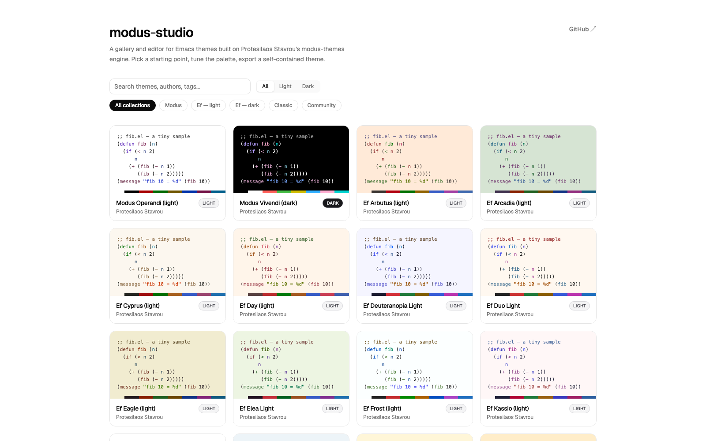
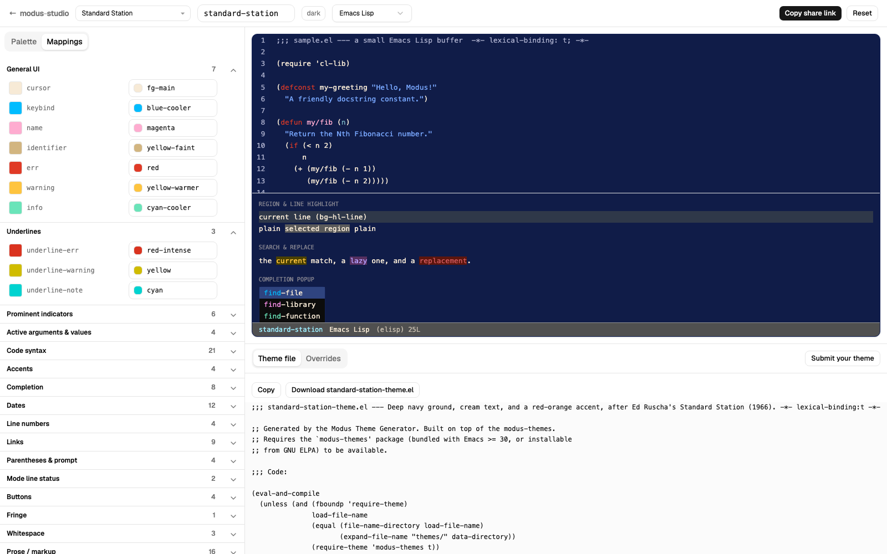

# modus-studio

A web gallery and live editor for Emacs themes built on Protesilaos Stavrou's
[modus-themes](https://github.com/protesilaos/modus-themes) engine. Browse
and preview 90 themes, edit any of them (named colors and semantic
role mappings) with a live tree-sitter-highlighted code preview, and export
a self-contained `.el` file that loads in stock Emacs. For Emacs users who
want a theme close to Modus or Ef but tuned to their taste, without writing
elisp.




## The themes

Every theme is a small pointer file under `themes/` naming its author's repo,
the `.el` files to read and a pinned commit. At build time
`scripts/resolve-themes.ts` fetches those files, reads the palette out of the
elisp and expands it with the same `generate-palette` math Emacs runs, so the
site copies no theme data and every card links to the upstream repo.

| Collection | Count | Source / credit                                                                                                                                                   |
| ---------- | ----- | ----------------------------------------------------------------------------------------------------------------------------------------------------------------- |
| Modus      | 8     | [Protesilaos Stavrou](https://github.com/protesilaos/modus-themes)                                                                                                |
| Ef         | 38    | [Protesilaos Stavrou](https://github.com/protesilaos/ef-themes)                                                                                                   |
| Classic    | 3     | Solarized colors by Ethan Schoonover, mappings from [solarized-emacs](https://github.com/bbatsov/solarized-emacs); Nord by [Sven Greb](https://www.nordtheme.com) |
| Community  | 41    | Themes their authors built on modus-themes, each credited and linked on its card                                                                                  |

## Adding a theme

Publish your theme in your own repo, then open a PR that adds one pointer file
under `themes/community/`:

```bash
pnpm run pin <owner/repo> <theme-symbol>
pnpm run resolve -- --update-lock
```

CI validates the pointer, resolves it, and the preview deploy shows it in the
gallery. Format and rules: [CONTRIBUTING.md](CONTRIBUTING.md).

## Fidelity

The palette generator is a TypeScript port of `modus-themes-generate-palette`,
verified digit-for-digit against real Emacs output. The Solarized port is
checked against bbatsov/solarized-emacs with CIEDE2000 color difference
(ΔE 0.00). Every exported `.el` file is confirmed to load in stock Emacs 30.2
and 31.1 via `emacs --batch`, and the resolver's palettes are checked key for
key against what Emacs 31 computes when it loads the same pinned files. Background on the palette engine, the two-layer
color/mapping model, and the API differences across Modus versions:
[docs/modus-ef-architecture.md](docs/modus-ef-architecture.md).

## Development

Requires [Nix](https://nixos.org) with flakes enabled (provides Node + pnpm),
and optionally [direnv](https://direnv.net) (`direnv allow` to auto-enter the
shell).

```bash
nix develop          # or: direnv allow
pnpm install
pnpm dev             # resolves the theme pointers, then Vite with HMR at http://localhost:3000
```

| Command              | What it does                                       |
| -------------------- | -------------------------------------------------- |
| `pnpm run resolve`   | Fetch pinned upstream files, write themes/resolved |
| `pnpm dev`           | Vite dev server with HMR                           |
| `pnpm run build`     | Production build to `dist/` (`vp build`)           |
| `pnpm run preview`   | Serve the production build (`vp preview`)          |
| `pnpm exec vp check` | Format + lint + typecheck (Oxfmt/Oxlint/tsgolint)  |
| `pnpm exec vp test`  | Run the Vitest suite (jsdom)                       |

## License

GPL-3.0-or-later, for the whole repo. The bundled palette data is
transcribed from GPL-3.0 upstreams (modus-themes, ef-themes, and the
Solarized/Nord ports), so the project inherits their license.
